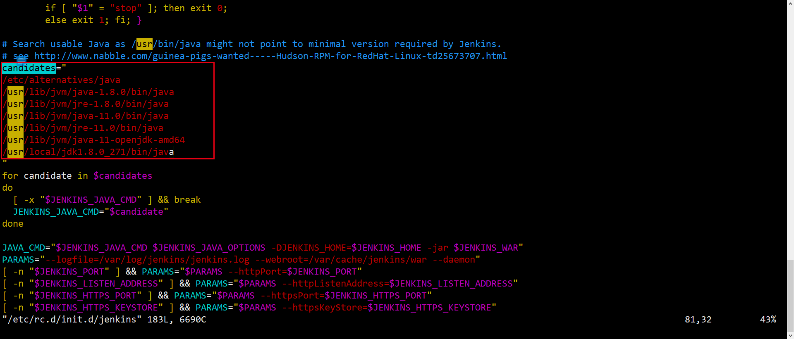
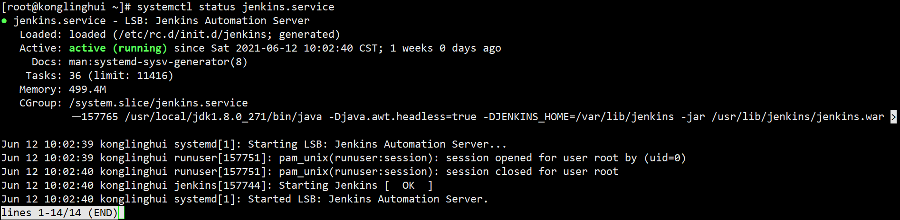
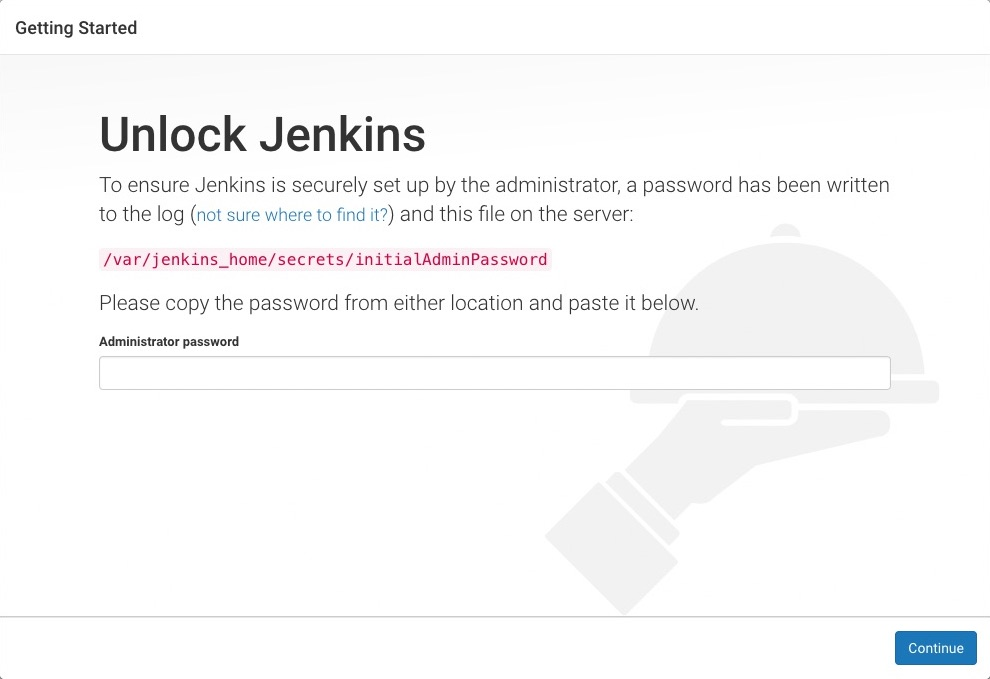

## 在CentOS上安装Jenkins

### 第一步：运行环境

| 操作系统 | CentOS Linux release 8.4.2105 |
| :------: | :---------------------------: |
|   JDK    |         **1.8.0_271**         |
|  Maven   |    **Apache Maven 3.8.1**     |
|   Git    |          **2.27.0**           |

### 第二步：安装Jenkins

```shell
sudo wget -O /etc/yum.repos.d/jenkins.repo https://pkg.jenkins.io/redhat-stable/jenkins.repo
sudo rpm --import https://pkg.jenkins.io/redhat-stable/jenkins.io.key
sudo yum upgrade
sudo yum install jenkins
sudo systemctl daemon-reload
```

### 第三步：配置自定义JDK

1. 打开 `/etc/rc.d/init.d/jenkins` 文件，在candidates属性中配置自定义JDK安装目录。如下图所示：



2. 加载配置文件信息

```shell
systemctl daemon-reload
systemctl status jenkins.service
```



### 第四步：启动Jenkins

```shell
systemctl start jenkins.service
```

### 第五步：解锁Jenkins

当你第一次访问新的Jenkins实例时，系统会要求您使用自动生成的密码对其进行解锁。

1. 浏览到 http://localhost:8080（或安装时为Jenkins配置的任何端口），并等待 解锁 Jenkins 页面出现。

2. 打开`/var/jenkins_home/secrets/initialAdminPassword`文件， 从Jenkins控制台日志输出中，复制自动生成的字母数字密码（在两组星号之间）。
  
3. 在 解锁Jenkins 页面上，将此 密码 粘贴到管理员密码字段中，然后单击 继续 。