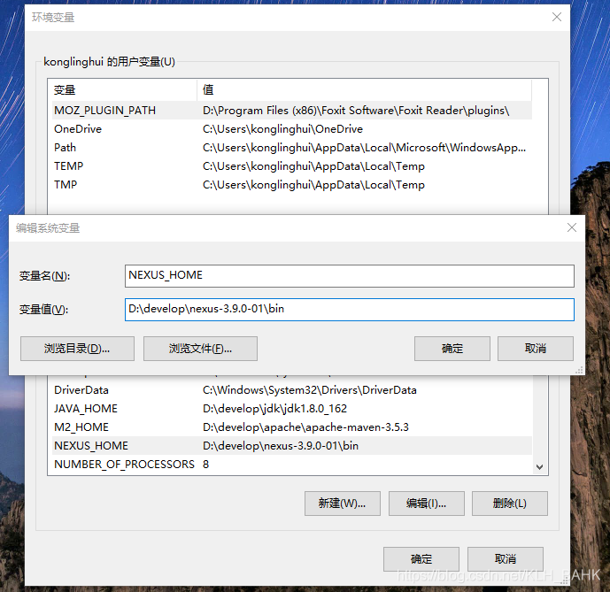
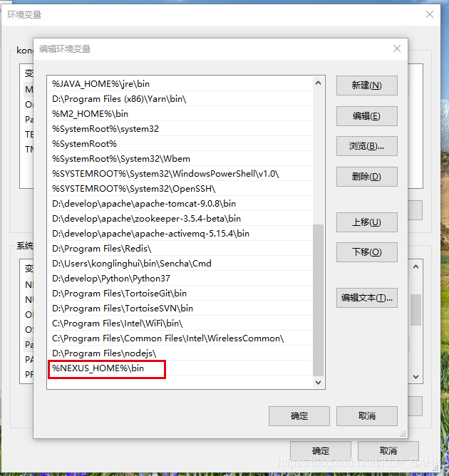

## 在windows安装Nexus
### 第一步：下载安装包
- [官网下载地址](https://download.sonatype.com/nexus/3/latest-win64.zip)
- [百度网盘链接](https://pan.baidu.com/s/1rYZ2snLnAgP220upN9c7uA) 提取码：s3vg

### 第二步：配置环境变量



### 第三步：自定义配置 ###

打开`nexus-3.9.0-01\etc\nexus-default.properties` 文件。不同版本下`nexus-default.properties`所在位置不同。

```properties
## DO NOT EDIT - CUSTOMIZATIONS BELONG IN $data-dir/etc/nexus.properties
##
# Jetty section
# 端口号
application-port=9000
application-host=0.0.0.0
nexus-args=${jetty.etc}/jetty.xml,${jetty.etc}/jetty-http.xml,${jetty.etc}/jetty-requestlog.xml
nexus-context-path=/

# Nexus section
nexus-edition=nexus-pro-edition
nexus-features=\
 nexus-pro-feature

```

### 第四步：运行环境变量配置

打开`nexus-3.9.0-01\bin\nexus.vmoptions`文件。

```properties
-Xms1200M
-Xmx1200M
-XX:MaxDirectMemorySize=2G
-XX:+UnlockDiagnosticVMOptions
-XX:+UnsyncloadClass
-XX:+LogVMOutput 
-XX:LogFile=../sonatype-work/nexus3/log/jvm.log
-XX:-OmitStackTraceInFastThrow
-Djava.net.preferIPv4Stack=true
-Dkaraf.home=.
-Dkaraf.base=.
-Dkaraf.etc=etc/karaf
-Djava.util.logging.config.file=etc/karaf/java.util.logging.properties
-Dkaraf.data=../sonatype-work/nexus3
-Djava.io.tmpdir=../sonatype-work/nexus3/tmp
-Dkaraf.startLocalConsole=false
```

### 第五步：运行相关命令

```shell
# 启动nexus服务 <optional-service-name>默认为nexus
nexus.exe /run <optional-service-name>
# 关闭nexus服务
nexus.exe /stop <optional-service-name>
# 重启nexus服务
nexus.exe /restart <optional-service-name>
#
nexus.exe /force-reload <optional-service-name>
#
nexus.exe /status <optional-service-name>
# 注册为windows服务运行
nexus.exe /install <optional-service-name>
# 删除服务
nexus.exe /uninstall <optional-service-name>
```

### 参考文档

- [官方文档](https://help.sonatype.com/repomanager3)
- [nexus3其他版本下载](https://blog.csdn.net/u010741112/article/details/103886347)