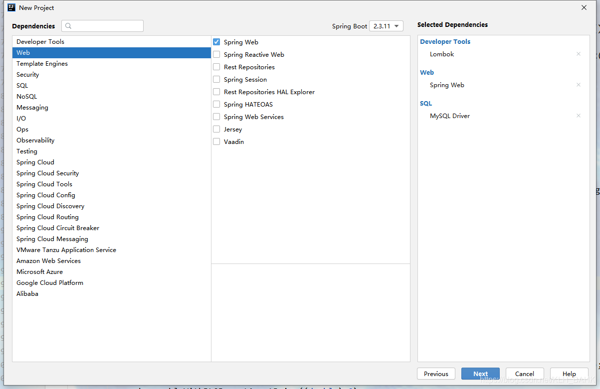
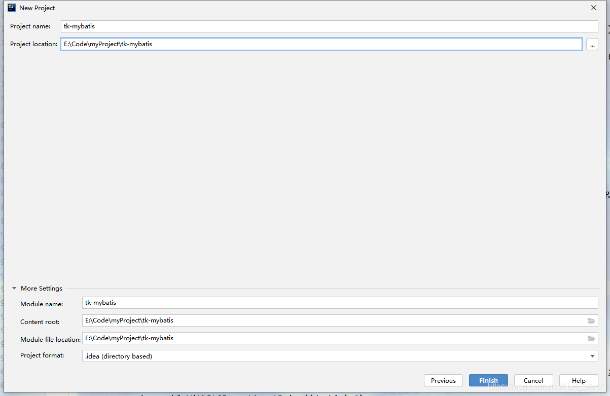

## 整合tk-mybatis

### tk-mybatis是什么

tk-mybatis就是一个框架或者说工具，其在mybatis的基础上进行了再次封装。使得我们可以不用写简单而重复的CRUD代码，又一次解放了生产力。

### 第一步：搭建SpringBoot项目







### 第二步：添加相关pom依赖，引入tk-mybatis

```xml
<dependency>
    <groupId>org.springframework.boot</groupId>
    <artifactId>spring-boot-starter-web</artifactId>
</dependency>
<!-- tk-mybatis -->
<dependency>
    <groupId>tk.mybatis</groupId>
    <artifactId>mapper-spring-boot-starter</artifactId>
    <version>2.1.5</version>
</dependency>
<dependency>
    <groupId>mysql</groupId>
    <artifactId>mysql-connector-java</artifactId>
    <scope>runtime</scope>
</dependency>
<!-- druid -->
<dependency>
    <groupId>com.alibaba</groupId>
    <artifactId>druid</artifactId>
    <version>1.2.6</version>
</dependency>
<dependency>
    <groupId>org.projectlombok</groupId>
    <artifactId>lombok</artifactId>
    <optional>true</optional>
</dependency>
```

### 第三步：Druid数据源配置

application.properties文件修改为application.yml文件。
1.数据源配置

```yml
spring:
  # 多数据源
  user:
    datasource:
      url: jdbc:mysql://127.0.0.1:3306/user?useUnicode=true&characterEncoding=utf-8&useSSL=true&serverTimezone=UTC
      username: root
      password: root
      type: com.alibaba.druid.pool.DruidDataSource
```

2.新建`config`包，创建`UserDataSourceConfig`类

```java
package com.example.config;

import org.apache.ibatis.session.SqlSessionFactory;
import org.mybatis.spring.SqlSessionFactoryBean;
import org.mybatis.spring.SqlSessionTemplate;
import org.slf4j.Logger;
import org.slf4j.LoggerFactory;
import org.springframework.beans.factory.annotation.Qualifier;
import org.springframework.boot.autoconfigure.jdbc.DataSourceProperties;
import org.springframework.boot.context.properties.ConfigurationProperties;
import org.springframework.context.annotation.Bean;
import org.springframework.context.annotation.Configuration;
import org.springframework.context.annotation.Primary;
import org.springframework.core.io.support.PathMatchingResourcePatternResolver;
import org.springframework.core.io.support.ResourcePatternResolver;
import org.springframework.jdbc.datasource.DataSourceTransactionManager;
import org.springframework.transaction.PlatformTransactionManager;
import tk.mybatis.spring.annotation.MapperScan;

import javax.annotation.Resource;
import javax.sql.DataSource;

/**
 * @author konglinghui
 * @description 数据源配置1
 * @date 2020/4/19 10:09
 **/
@Configuration
@MapperScan(basePackages = {"com.example.mapper.user"},
        sqlSessionTemplateRef = "userSqlSessionTemplate")
public class UserDataSourceConfig {

    private static final Logger LOGGER = LoggerFactory.getLogger(UserDataSourceConfig.class);

    /**
     * 数据源配置对象
     * Primary 表示默认的对象，Autowire可注入，不是默认的得明确名称注入
     *
     * @return
     */
    @Bean
    @Primary
    @ConfigurationProperties("spring.user.datasource")
    public DataSourceProperties userDataSourceProperties() {
        return new DataSourceProperties();
    }

    /**
     * 数据源对象
     *
     * @return
     */
    @Bean
    public DataSource userDataSource() {
        DataSourceProperties dataSourceProperties = this.userDataSourceProperties();
        return dataSourceProperties.initializeDataSourceBuilder().build();
    }

    /**
     * 配置事务
     *
     * @param userDataSource
     * @return
     */
    @Bean
    @Resource
    public PlatformTransactionManager userTransactionManager(@Qualifier("userDataSource") DataSource userDataSource) {
        return new DataSourceTransactionManager(userDataSource);
    }

    /**
     * 配置Mapper路径
     *
     * @param dataSource
     * @return
     */
    @Bean
    public SqlSessionFactory userSqlSessionFactory(@Qualifier("userDataSource") DataSource dataSource) {
        SqlSessionFactoryBean sqlSessionFactoryBean = new SqlSessionFactoryBean();
        sqlSessionFactoryBean.setDataSource(dataSource);
        // 添加XML目录
        ResourcePatternResolver resolver = new PathMatchingResourcePatternResolver();
        try {
            sqlSessionFactoryBean.setTypeAliasesPackage("com.example.entity.user");
            sqlSessionFactoryBean.setMapperLocations(resolver.getResources("classpath*:mapper/user/**Mapper.xml"));
            return sqlSessionFactoryBean.getObject();
        } catch (Exception e) {
            if (LOGGER.isInfoEnabled()) {
                LOGGER.info("配置Mapper路径发生异常:{}", e.getMessage());
            }
            e.printStackTrace();
        }

        return null;
    }

    /**
     * 配置SqlSessionTemplate
     *
     * @param sqlSessionFactory
     * @return
     */
    @Bean
    public SqlSessionTemplate userSqlSessionTemplate(@Qualifier("userSqlSessionFactory")
                                                             SqlSessionFactory sqlSessionFactory) {
        return new SqlSessionTemplate(sqlSessionFactory);
    }
}

```

3. 新建实体类

```java
package com.example.entity.user;

import lombok.AllArgsConstructor;
import lombok.Builder;
import lombok.Data;
import lombok.NoArgsConstructor;

import javax.persistence.Column;
import javax.persistence.Id;
import javax.persistence.Table;

/**
 * @author konglinghui
 * @description
 * @date 2021/6/1 13:55
 */
@Data
@Builder
@NoArgsConstructor
@AllArgsConstructor
@Table(name = "user")
public class User {

    @Id
    @Column(name = "id")
    private Integer id;

    @Column(name = "name")
    private String name;

    @Column(name = "age")
    private Integer age;
}
```

4. 自定义基础Mapper接口

```java
package com.example.mapper;

import tk.mybatis.mapper.common.ConditionMapper;
import tk.mybatis.mapper.common.ExampleMapper;
import tk.mybatis.mapper.common.IdsMapper;
import tk.mybatis.mapper.common.MySqlMapper;

import java.util.List;

/**
 * @author konglinghui
 * @description mapper基类
 * @date 2021/6/01 15:47
 **/
public interface BaseMapper<T> extends tk.mybatis.mapper.common.BaseMapper<T>,
        MySqlMapper<T>,
        IdsMapper<T>,
        ConditionMapper<T>,
        ExampleMapper<T> {
}
```

5. 新建Mapper接口文件

```java
package com.example.mapper.user;

import com.example.entity.user.User;
import com.example.mapper.BaseMapper;

/**
 * @author konglinghui
 * @description
 * @date 2021/6/1 13:52
 */
public interface UserMapper extends BaseMapper<User> {
}
```

6. 新建Controller类

```java
package com.example.controller;

import com.example.entity.user.User;
import com.example.mapper.user.UserMapper;
import org.springframework.beans.factory.annotation.Autowired;
import org.springframework.web.bind.annotation.GetMapping;
import org.springframework.web.bind.annotation.RequestMapping;
import org.springframework.web.bind.annotation.RequestParam;
import org.springframework.web.bind.annotation.RestController;

import java.util.List;

/**
 * @author konglinghui
 * @description
 * @date 2021/6/1 14:02
 */
@RestController
@RequestMapping("/user")
public class UserController {

    @Autowired
    private UserMapper userMapper;

    @GetMapping("/create")
    public List<User> create() {
        User user = User.builder()
                .name("张三")
                .age(111)
                .build();
        userMapper.insert(user);

        return userMapper.selectAll();
    }

    @GetMapping("/update")
    public List<User> update(@RequestParam Integer id) {
        User user = User.builder()
                .id(id)
                .age(222)
                .build();
        userMapper.updateByPrimaryKey(user);

        return userMapper.selectAll();
    }

    @GetMapping("/delete")
    public List<User> delete(@RequestParam Integer id) {
        User user = User.builder()
                .id(id)
                .build();
        userMapper.deleteByPrimaryKey(user);

        return userMapper.selectAll();
    }
}
```

### 第四步：测试

http://localhost:8080/user/create
http://localhost:8080/user/update?id=1
http://localhost:8080/user/delete?id=1

----

### Mapper接口相关API

| 接口                                                         | 用法                                                         |
| :----------------------------------------------------------- | :----------------------------------------------------------- |
| int insertSelective(T var1);                                 | 保存一个实体，null的属性不会保存，会使用数据库默认值         |
| int insertUseGeneratedKeys(T record);                        | 插入数据，限制为实体包含`id`属性并且必须为自增列，实体配置的主键策略无效 |
| int updateByPrimaryKeySelective(T record);                   | 根据主键更新属性不为null的值                                 |
| int updateByExampleSelective(@Param("record") T record, @Param("example") Object example); | 根据Example条件更新实体`record`包含的不是null的属性值        |
